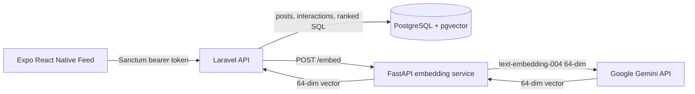

# Guised Up — Real Connections Social Feed

[](https://laravel.com)
[](https://fastapi.tiangolo.com)
[](https://expo.dev)
[](https://www.postgresql.org)
[](https://www.docker.com)

Guised Up is a modern social platform designed to help people show up authentically online. By eliminating standard popularity constructs—such as follower counts, public likes, shares, or comment volume—the platform shifts focus entirely to genuine human connection.

This repository contains the complete full-stack implementation, including the React Native mobile client, Laravel API backend, FastAPI embedding microservice, PostgreSQL/pgvector database setup, and a collection of optimized raw SQL queries.

---

## Core Product Features

1. **The "RealConnections" Feed:**
   A personalized, multi-signal feed that ranks posts without engagement bias. The ranking score ($0.0$ to $1.0$) is calculated server-side based on four signals:
   - **Semantic Similarity (40%):** Measures how closely a post aligns with the viewer's interests (averaged from posts the viewer has previously interacted with).
   - **Relationship Depth (30%):** Logarithmically weights the count of interactions between the viewer and the post's author over the last 90 days.
   - **Post Authenticity (15%):** Uses a heuristic algorithm that checks for personal expression (first-person voice) while penalizing hashtags, link-farming, all-caps, and promotional jargon.
   - **Time Decay (15%):** Applies an exponential decay with a 7-day half-life to keep the feed fresh without sacrificing relevance.

2. **Semantic Natural Language Search:**
   Enables users to search concepts or feelings conceptually (e.g., _"honest thoughts about technology"_ or _"nature moments"_) rather than relying on exact keyword matching. Powered by 64-dimensional Google Gemini embeddings indexed in PostgreSQL via `HNSW`.

3. **Authenticity Quality Pills:**
   The mobile client analyzes the server's authenticity score and presents it as qualitative markers rather than raw statistics:
   - `✦ Authentic Voice` ($\ge 80\%$)
   - `◈ Organic Moment` ($65\% - 79\%$)
   - `◎ Curated` ($50\% - 64\%$)
   - `▲ Promotional` ($< 50\%$)

4. **Interaction Logging:**
   Every view, reply, or reaction registers an interaction to automatically train the viewer's profile interest vector and build relationship depth with the author.

---

## Project Structure

```text
├── backend/                   # Laravel 11 core backend API
│   ├── app/Http/Controllers/  # Controllers for Feed, Posts, and Interactions
│   ├── app/Services/          # FeedRankingService & EmbeddingClient
│   ├── database/migrations/   # Database table schemas (including pgvector types)
│   └── tests/                 # PHPUnit test suite (Unit & Feature tests)
├── backend/embedding-service/ # FastAPI Python microservice
│   └── app/main.py            # Gemini Embeddings API wrapper & fallback hashing
├── mobile/                    # Expo React Native application
│   ├── src/context/           # AuthContext for state & Axios wrapper
│   └── src/screens/           # HomeScreen, SearchScreen, and ProfileScreen
├── sql/                       # SQL Challenge queries
│   └── queries.sql            # Raw Postgres analytics queries (D1 - D4)
├── docs/                      # Architectural documentation
│   └── TSD.md                 # Technical Solution Document (TSD)
└── docker-compose.yml         # Container configuration for DB and Embedding service
```

---

## System Architecture



For a detailed analysis of architectural decisions, database index optimizations, schema designs, and design trade-offs, refer to the [Technical Solution Document](file:///c:/Users/ssaaaadd/Documents/GuisedUp-Assignment/docs/TSD.md).

---

## Setup & Installation

### 1. Prerequisites

Ensure you have the following installed on your local machine:

- **Docker & Docker Compose**
- **Composer** (for PHP dependencies)
- **Node.js & npm** (for React Native)
- **PHP 8.2+**

---

### 2. Setting Up the Backend & Services

1. Navigate to the `backend` folder:
   ```bash
   cd backend
   ```
2. Copy the environment template and configure your parameters:

   ```bash
   cp .env.example .env
   ```

   _Note: If you have a Google Gemini API Key, set it in your `.env` as `GEMINI_API_KEY`. If not, the FastAPI service will gracefully fall back to a deterministic 64-dimensional local hashing algorithm for vector searches._

3. Spin up PostgreSQL and the FastAPI embedding service using Docker:
   ```bash
   docker compose up --build -d
   ```
4. Install PHP dependencies:
   ```bash
   composer install
   ```
5. Generate the application key:
   ```bash
   php artisan key:generate
   ```
6. Run migrations and seed the database with test data:
   ```bash
   php artisan migrate --seed
   ```
7. Start the Laravel development server:
   ```bash
   php artisan serve --host=0.0.0.0 --port=8000
   ```

---

### 3. Setting Up the Mobile App

1. Navigate to the `mobile` folder:
   ```bash
   cd ../mobile
   ```
2. Install npm dependencies:
   ```bash
   npm install
   ```
3. Start the Expo developer server:
   ```bash
   npx expo start
   ```
   _Press `a` to run on an Android Emulator, `i` to run on an iOS Simulator, or scan the QR code using the Expo Go app on your physical device._

---

### 4. Running Backend Tests

To verify that the database connections, embeddings, and ranking algorithms function as expected, execute the test suite in the `backend` directory:

```bash
php artisan test
```

---

## Seeded Demo Accounts

You can log in to the mobile application using the following pre-seeded test accounts:

| Email                   | Password   | Role                           |
| :---------------------- | :--------- | :----------------------------- |
| **maya@guisedup.test**  | `password` | Seeker / Authenticity Advocate |
| **arjun@guisedup.test** | `password` | Creator / Tech Blogger         |

---

## SQL Analytics Challenges

The assignment raw SQL challenges are solved and structured in the [queries.sql](file:///c:/Users/ssaaaadd/Documents/GuisedUp-Assignment/sql/queries.sql) file. These queries answer:

- **D1:** Top 10 most active users in the last 7 days based on total interactions received.
- **D2:** User-specific feed showing posts from their top interactors over the last 30 days.
- **D3:** Identifying popular "read-only" posts (posts with over 100 views but 0 reactions).
- **D4:** Basic spam detection query targeting creators posting more than 20 times in a 24-hour window.

---

## AI-Augmented Workflow

This project was built following an AI-augmented workflow using agentic coding assistance. AI tools were utilized to:

1. **Scaffold Boilerplate:** Set up initial Laravel migrations, routing files, and React Native style templates.
2. **Refine Ranking Math:** Prototype the mathematical scoring curves for relationship depth (logarithmic normalization) and time decay (half-life decay).
3. **Draft the Authenticity Heuristic:** Iterate on character matching and regex patterns for link detection, hashtag counting, and case-sensitive checks in PHP.
4. **Draft Unit Tests:** Write seeders and test cases verifying that fallbacks and vector calculations operate within bounds.
