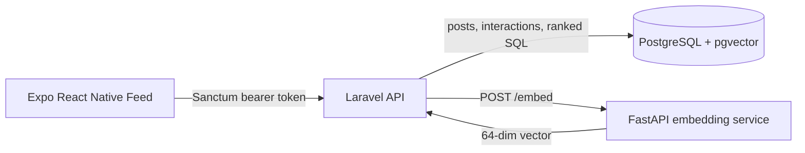

# Technical Solution Document: Real Connections Feed

## Product intent

The feed rewards signals of real connection, not popularity. Likes, shares, comments, and follower count are deliberately absent from ranking. A post rises when it is timely, semantically relevant to the viewer, authored by someone the viewer actually interacts with, and appears authentic rather than polished for engagement.

## Architecture



Laravel owns authentication, validation, ranking, and the public API. FastAPI owns the embedding adapter. PostgreSQL is both the transactional store and vector database, avoiding a second data store and synchronization pipeline.

## Schema and indexes

`users` contains account identity. `posts` belongs to a user and stores text, optional image URL, `authenticity_score`, and `embedding vector(64)`. `interactions` belongs to both viewer and post and records `view`, `reply`, or `reaction`; it is the source of relationship depth. `follows` is intentionally omitted from v1 because it is not needed to prove genuine interaction depth.

- `posts(user_id, created_at DESC)` supports author and recency reads.
- `interactions(user_id, created_at DESC)` and `interactions(post_id, type)` support relationship and analytics queries.
- An HNSW cosine index on `posts.embedding` supports semantic nearest-neighbour search.

## Authentication and API

Laravel Sanctum issues a bearer token from `POST /api/login`. All feature routes require `auth:sanctum`. Seeded users are `maya@guisedup.test` and `arjun@guisedup.test`, both with password `password`.

| Endpoint                 | Request                | Response                              |
| ------------------------ | ---------------------- | ------------------------------------- |
| `POST /api/posts`        | `{text, image_url?}`   | Created post with author and time ago |
| `GET /api/feed?page=`    | authenticated          | Paginated, ranked posts; 20 per page  |
| `GET /api/search?q=`     | natural-language query | Top 10 semantically nearest posts     |
| `POST /api/interactions` | `{post_id, type}`      | Created interaction                   |

Errors are JSON with Laravel validation errors or an explicit `message`; unauthenticated calls return 401.

## Ranking design

Each candidate gets four normalized signals:

1. **Semantic relevance (40%)**: cosine similarity between the post vector and a viewer-interest vector averaged from posts the viewer has interacted with.
2. **Relationship depth (30%)**: logarithmically normalized count of the viewer's interactions with that author in the last 90 days.
3. **Authenticity (15%)**: a transparent heuristic, reduced for excessive hashtags, links, and punctuation; a production system would add consented media/text-quality features and fairness review.
4. **Time decay (15%)**: exponential recency signal with a seven-day half-life-style window.

```text
interest = average(embedding(post) for each post viewer interacted with)
for post in recent candidates:
  semantic = cosine(post.embedding, interest)
  relationship = log(1 + viewer_interactions_with(post.author)) / log(21)
  freshness = exp(-age_in_seconds / 604800)
  score = .40*semantic + .30*relationship + .15*authenticity + .15*freshness
return candidates ordered by score descending, then newest first
```

There is no likes, shares, comments, or follower-count feature in this score.

## Embeddings and trade-offs

The included FastAPI service produces a deterministic normalized 64-dimension hash embedding. It is free, reproducible, fast, and suitable for demonstrating storage, cosine search, and API flow; it is **not semantically equivalent to a trained embedding model**. The `EmbeddingClient` service boundary means production can replace only FastAPI's adapter with OpenAI `text-embedding-3-small` (or a locally hosted sentence-transformer), migrate to that dimension, backfill post vectors, and keep all public Laravel contracts unchanged.

Using pgvector keeps writes transactional and eliminates dual-write drift. An external vector DB would be considered when scale or independent retrieval tuning outweighs this operational simplicity.

## AI-assisted workflow

OpenAI Codex was used to assist in drafting this architecture, scaffold implementation files, generate baseline tests and SQL, and review the planned edge cases. All choices, tradeoffs, and final code were reviewed and adapted for this submission.
